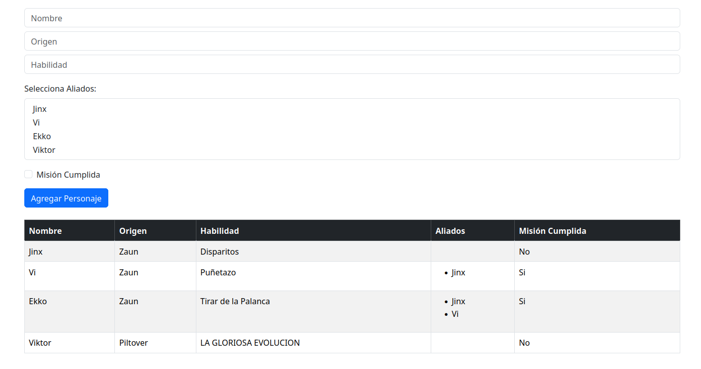

# Primera App Vue
- [Primera App Vue](#primera-app-vue)
  - [Instalacion](#instalacion)
    - [Crear nueva app](#crear-nueva-app)
  - [Explicacion del codigo](#explicacion-del-codigo)
    - [Template](#template)
      - [Inputs](#inputs)
        - [Texts](#texts)
        - [Select](#select)
        - [Checkbox](#checkbox)
        - [Button](#button)
      - [Table](#table)
    - [Script](#script)
      - [Declaraciones](#declaraciones)
      - [Agregar Personaje](#agregar-personaje)
  - [Ejemplo Visual](#ejemplo-visual)


## Instalacion
### Crear nueva app

```bash
vue create mi-primera-app
```

En las opciones seleccionaremos vue 3

## Explicacion del codigo

### Template
#### Inputs
```html
    <div class="mb-3">
      <input type="text" class="form-control mb-2" placeholder="Nombre" v-model="nombre" />
      <input type="text" class="form-control mb-2" placeholder="Origen" v-model="origen" />
      <input type="text" class="form-control mb-2" placeholder="Habilidad" v-model="habilidad" />
    </div>

    <div class="mb-3">
      <label for="aliados" class="form-label">Selecciona Aliados:</label>
      <select id="aliados" multiple class="form-select" v-model="aliadosSeleccionados">
        <option v-for="aliado in personajes" v-bind:key="aliado.nombre" v-bind:value="aliado">
          {{ aliado.nombre }}
        </option>
      </select>
    </div>

    <div class="form-check mb-3">
      <input type="checkbox" class="form-check-input" id="misionCumplida" v-model="misionCumplida" />
      <label class="form-check-label" for="misionCumplida">
        Misión Cumplida
      </label>
    </div>

    <button class="btn btn-primary mb-4" @click="agregarPersonaje">
      Agregar Personaje
    </button>
```
Estos son los inputs del projecto, los cuales ahora explicaremos cada uno detalladamente

##### Texts
```html
    <div class="mb-3">
      <input type="text" class="form-control mb-2" placeholder="Nombre" v-model="nombre" />
      <input type="text" class="form-control mb-2" placeholder="Origen" v-model="origen" />
      <input type="text" class="form-control mb-2" placeholder="Habilidad" v-model="habilidad" />
    </div>
```
Estos consisten en inputs de tipo text con un v-model, este v-model sirve para acceder al DOM, permitiendo obtener la información del input, como modificarla

##### Select
```html
<div class="mb-3">
      <label for="aliados" class="form-label">Selecciona Aliados:</label>
      <select id="aliados" multiple class="form-select" v-model="aliadosSeleccionados">
        <option v-for="aliado in personajes" v-bind:key="aliado.nombre" v-bind:value="aliado">
          {{ aliado.nombre }}
        </option>
      </select>
    </div>
```
Mas adelante, veremos que tenemos una lista llamada personajes, donde almacenamos volatilmente la informacion de los personajes creados, sabiendo eso, usamos la directiva v-for para recorrec por cada elemento de la lista y ir creando cada uno de las opciones para que despues el usuario pueda elegir varios (ya que es multiple) aliados.

Después, usamosel v-bind:key (o :key) para asignarle una "id" de manera dinamica, y asi VUE y nosotros poder localizarlo en el DOM.

Este select esta relacionado a aliadosSeleccionados, para acceder y modificar el DOM, como nombramos anteriormente.

Para terminar, asociaremos a cada opcion un valor, que después sera el que es establecido en el v-model puesto, devolviendo una lista de aliados.

##### Checkbox
```html
    <div class="form-check mb-3">
      <input type="checkbox" class="form-check-input" id="misionCumplida" v-model="misionCumplida" />
      <label class="form-check-label" for="misionCumplida">
        Misión Cumplida
      </label>
    </div>
```

El checkbox lo asignaremos denuevo a un v-model, para poder acceder a su informacion, y este consistira de un true o false

##### Button
```html
<button class="btn btn-primary mb-4" @click="agregarPersonaje">
      Agregar Personaje
    </button>
```
Este boton llamara a la funcion agregarPersonaje al hacer click, que mostraremos mas adelante

#### Table
```html
    <div v-if="personajes.length > 0" class="table-responsive">
      <table class="table table-bordered table-hover table-striped">
        <thead class="table-dark">
          <tr>
            <th>Nombre</th>
            <th>Origen</th>
            <th>Habilidad</th>
            <th>Aliados</th>
            <th>Misión Cumplida</th>
          </tr>
        </thead>
        <tbody>
          <tr v-for="personaje in personajes" :key="personaje.nombre">
            <td>{{ personaje.nombre }}</td>
            <td>{{ personaje.origen }}</td>
            <td>{{ personaje.habilidad }}</td>
            <td>
              <ul>
                <li v-for="aliado in personaje.aliados" :key="aliado.nombre">
                  {{ aliado.nombre }}
                </li>
              </ul>
            </td>
            <td>{{ personaje.misionCumplida ? 'Si' : 'No' }}</td>
          </tr>
        </tbody>
      </table>
    </div>
```
Esto consta de una tabla, que primero comprueba si la lista de personajes no esta vacia para evitar mostrarla sin datos.

Después usando la directiva v-for, recorremos cada uno de los personajes, para asi obtener sus datos y mostrarlos, siempre asignamos una key para poder acceder en algun caso a ese campo.

Ademas, usamos un ternario para en misionCumplida, comprobar si es true o false, y mostrar "Sí" o "No".

Y por ultimo, podemos observar otra directiva v-for, para mostrar cada uno de los aliados del personaje (solo en nombre).

### Script
```ts
<script setup lang="ts">
import { ref } from 'vue';

type Personaje = {
  nombre: string;
  origen: string;
  habilidad: string;
  aliados: Personaje[];
  misionCumplida: boolean;
};

const personajes = ref<Personaje[]>([]);
const nombre = ref('');
const origen = ref('');
const habilidad = ref('');
const aliadosSeleccionados = ref<Personaje[]>([]);
const misionCumplida = ref(false);

const agregarPersonaje = () => {
  const nuevoPersonaje: Personaje = {
    nombre: nombre.value,
    origen: origen.value,
    habilidad: habilidad.value,
    aliados: [...aliadosSeleccionados.value],
    misionCumplida: misionCumplida.value,
  };

  personajes.value.push(nuevoPersonaje);

  nombre.value = '';
  origen.value = '';
  habilidad.value = '';
  aliadosSeleccionados.value = [];
  misionCumplida.value = false;
};
</script>
```
#### Declaraciones
```ts
type Personaje = {
  nombre: string;
  origen: string;
  habilidad: string;
  aliados: Personaje[];
  misionCumplida: boolean;
};

const personajes = ref<Personaje[]>([]);
const nombre = ref('');
const origen = ref('');
const habilidad = ref('');
const aliadosSeleccionados = ref<Personaje[]>([]);
const misionCumplida = ref(false);
```
Comenzamos declarando el tipo personaje, para poder manejar la informacion mas facilmente.

Despues, instanciamos una referencia vacia para cada v-model que habiamos creado anteriormente

#### Agregar Personaje
```ts
const agregarPersonaje = () => {
  const nuevoPersonaje: Personaje = {
    nombre: nombre.value,
    origen: origen.value,
    habilidad: habilidad.value,
    aliados: [...aliadosSeleccionados.value],
    misionCumplida: misionCumplida.value,
  };

  personajes.value.push(nuevoPersonaje);

  nombre.value = '';
  origen.value = '';
  habilidad.value = '';
  aliadosSeleccionados.value = [];
  misionCumplida.value = false;
};
```
Comenzamos creando un nuevo personaje, añadiendole los campos actuales que contienen las referencias.

Después, continuamos metiendolo en la lista, la cual se renderizara en la tabla.

Y por ultimo, limpiamos los valores de las referencias, asi limpiando los valores que tienen vinculalos en el DOM

## Ejemplo Visual

